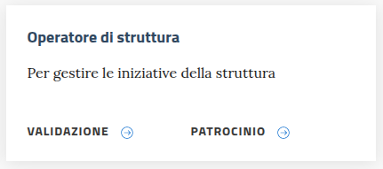
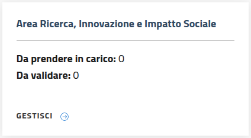

.. pe.unical.it - Public Engagement platform documentation master file, created by
   sphinx-quickstart on Thu Mar 27 17:35:26 2025.
   You can adapt this file completely to your liking, but it should at least
   contain the root `toctree` directive.

Guida per l'operatore di struttura
==================================

L’operatore di struttura è il delegato docente/PTA alla TM che ha la possibilità di monitorare in qualsiasi momento lo stato delle iniziative caricate dai singoli referenti di struttura nell’anno in corso (e a breve anche quelle caricate negli anni precedenti).

Accesso all'area dedicata
*************************

La sezione dedicata ai referenti/delegati è indicata dal box

----------

Scelta della struttura di competenza
************************************

Ogni operatore può afferire a diverse strutture. Scegliendone una, quindi,
gestisce le iniziative collegate.

----------

Validazione delle iniziative
****************************

La procedura di validazione, che può essere effettuata solo se i termini
per il monitoraggio delle iniziative nell'anno di riferimento sono aperti,
si articola in poche basilari operazioni:

* presa in carico dell'inziativa

  .. image:: images/operatore_struttura/buttons_handle.png

* eventuale modifica/integrazione dei dati inseriti dal referente/delegato

  .. image:: images/referente/buttons_edit.png

* accesso all'interfaccia per l'inserimento dell'esito della validazione

  .. image:: images/operatore_struttura/buttons_validate.png

* conferma esito della validazione

  .. image:: images/operatore_struttura/validation.png

  Un esito negativo presuppone l'inserimento delle note che specifichino le motivazioni della scelta.

----------

Gestione richiesta di patrocinio
********************************

Questa procedura può essere effettuata solo se:

* l'iniziativa non è ancora iniziata;
* l'iniziativa è stata valutata positivamente dall'operatore di validazione.

L'operatore addetto non ha diritto di modificare i dati inseriti dal referente.

Prevede esclusivamente:

* la presa in carico dell'inziativa

  .. image:: images/operatore_struttura/buttons_handle.png

* l'accesso all'interfaccia per l'inserimento dell'esito della validazione

  .. image:: images/operatore_struttura/buttons_validate.png

* la conferma esito della validazione

  .. image:: images/operatore_struttura/validation.png

 Come per la validazione, un esito negativo presuppone l'inserimento delle note che specifichino le motivazioni della scelta.

----------

Riapertura della validazione
****************************

L'operazione di riapertura della validazione

può essere effettuata solo in determinati casi:

* se a richiederla è l'operatore per la validazione

    * i termini per il monitoraggio nell'anno di riferimento devono essere aperti;
    * l'iniziativa non deve essere stata presa in carico dall'operatore per la gestione del patrocinio;
    * l'iniziativa non deve aver subito modifiche da parte degli operatori di Ateneo.

* se è l'operatore per la gestione del patrocinio

    * i termini per il monitoraggio nell'anno di riferimento devono essere aperti;
    * l'iniziativa deve ancora iniziare;
    * l'iniziativa non deve aver subito modifiche da parte degli operatori di Ateneo.
