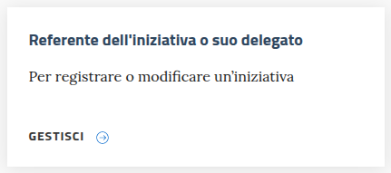
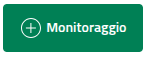
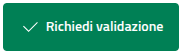
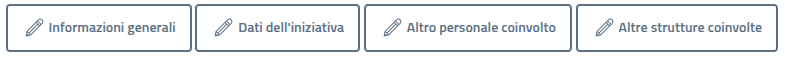
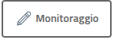
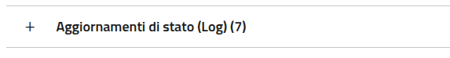

.. pe.unical.it - Public Engagement platform documentation master file, created by
   sphinx-quickstart on Thu Mar 27 17:35:26 2025.
   You can adapt this file completely to your liking, but it should at least
   contain the root `toctree` directive.

Guida per il referente/delegato
===============================

Il referente è il personale UNICAL (docente/ricercatore) che ha la responsabilità scientifica dell’iniziativa di PE. Il delegato è una persona delegata dal/i responsabile/i scientifico/i a caricare i dati monitoraggio.

Accesso all'area dedicata
****************************

La sezione dedicata ai referenti/delegati è indicata dal box

Inserimento nuova iniziativa
****************************

L’inserimento di una nuova iniziativa di PE prevede diversi step:

* accesso all'interfaccia di inserimento mediante il pulsante;

  .. image:: images/referente/add_new.png

* scelta del referente: se si tratta dell'utente che sta compilando basta scegliere “sono io”, altrimenti è possibile selezionare la persona tra tutto il personale dell’Ateneo

  .. image:: images/referente/choose_referent.png

* caricamento delle informazioni generali dell’iniziativa (titolo, le date di inizio e di fine e la struttura proponente)

  .. image:: images/referente/basic_data.png

* caricamento dei dati dell'iniziativa utilizzando il form dedicato

  .. image:: images/referente/buttons_data.png

* aggiunta, opzionale, di altre strutture o personale coinvolto;

  .. image:: images/referente/buttons_involved_entities.png

Iniziative future (ex-ante)
---------------------------

Se l’operazione di inserimento avviene prima dell’inizio dell’iniziativa, il referente/delegato:

* può scegliere di richiedere il patrocinio della struttura. Per patrocinio si intende il processo di accreditamento dell’iniziativa da parte del Dipartimento (es. Consiglio di Dipartimento/Direttore) per il rilascio formale dell’uso del logo di dipartimento;
* può scegliere di richiedere la promozione sui canali istituzionali;
* una volta inseriti i dati può richiederne la validazione agli operatori della struttura. Per validazione si intende il processo di verificare che il delegato di struttura fa per accertare che l’iniziativa rientri nella categoria del PE secondo i criteri definitori di ANVUR, riportati nella sezione iniziale della Guida;
* può procedere all’inserimento dei dati di monitoraggio dopo il termine dell’iniziativa, solo se quest’ultima è stata validata con successo

Iniziative in corso
-------------------

Se l’operazione di inserimento avviene ad iniziativa già iniziata, il referente/delegato:

* non può scegliere di richiedere il patrocinio della struttura;
* non può scegliere di richiedere la promozione sui canali istituzionali;
* una volta inseriti i dati può richiederne la validazione agli operatori della struttura;
* dovrà procedere all’inserimento dei dati di monitoraggio dopo il termine dell’iniziativa, solo se quest'ultima è stata validata con successo

Iniziative terminate (ex-post)
------------------------------

Se l’iniziativa è terminata, il referente/delegato:

* non può scegliere di richiedere il patrocinio della struttura;
* non può scegliere di richiedere la promozione sui canali istituzionali;
* inserisce i dati dell’iniziativa e, contestualmente, quelli di monitoraggio e può richiederne la validazione agli operatori della struttura

----------

Inserimento dati di monitoraggio
********************************

La procedura è guidata dal relativo form della “Scheda di monitoraggio PE”

----------

Richiesta di validazione dei dati
*********************************

Una volta inseriti tutti i dati obbligatori è possibile richiedere la
validazione di questi ultimi alla struttura di riferimento

----------

Annullamento richiesta di validazione
*************************************

La richiesta di validazione può essere annullata se nessun operatore di struttura
l'ha presa in carico

----------

Modifica dei dati inseriti
**************************

Il referente/delegato può modificare i dati inseriti se non c'è una
richiesta di validazione attiva

I dati di monitoraggio possono essere modificati in qualsiasi momento
fino alla chiusura dei termini per l’anno di riferimento

----------

Eliminazione iniziativa
***********************

Il referente/delegato può eliminare una propria iniziativa se non c'è una
richiesta di validazione attiva

----------

Duplicazione iniziativa
***********************

Il referente/delegato può duplicare una propria iniziativa in qualsiasi
momento, a prescindere dallo stato in cui questa si trovi

----------

Dettagli e aggiornamenti di stato (log)
***************************************

Ogni aggiornamento dell’iniziativa da parte degli operatori viene notificato
al referente/delegato tramite e-mail e può comunque essere visualizzato
nella scheda di dettaglio dell’iniziativa.

